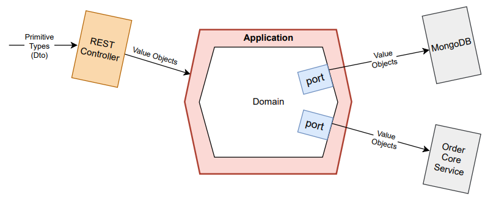

## Ports

W architekturze hexagonalnej za pomocą portów chcemy odseparować logikę biznesową od warstwy infrastruktury. To za ich pomocą pobieramy albo wysyłamy dane. Zdefiniowane są przez warstwę domeny.
To domena, czyli klient interakcji definiuje kontrakt, do którego muszą dostosować się adaptery ([RequiredInterface](https://martinfowler.com/bliki/RequiredInterface.html)). Zyskujemy dzięki temu plugginowość, która umożliwia wymianę adapterów bez wpływu na logikę biznesową oraz lepszą testowalność.



Porty mogą być używane również po lewej stronie hexagonu (Primary/Driving Ports). W teorii zabezpieczają one logikę biznesową przez niechcianymi zależnościami od strony adapterów wejściowych, które ją wołają, ale czy na pewno? Przecież nic nie stoi na przeszkodzie, aby port zdefiniować tak, aby zwracał np. ResponseEntity oczekiwany przez REST Controller.

Czy użycie portów podnosi testowalność?
To czy na poziomie testu integracyjnego dla na przykład REST Controllera (@WebMvcTest) użyję referencji do portu czy konkretnej implementacji niewiele zmienia.

Ważne, by pilnować, aby obiekty zdefiniowane przez warstwę adapterów wejściowych (primary adapters) nie wnikały do naszych use cases. Założenie to weryfikowane jest przez poniższy test architektury.


```kotlin
    /*
     No dependency on API layer forces developers to map request objects into command/query objects defined by application layers.
     Request objects consist of primitive types that we want to avoid in the application/domain in favor of Value Objects.
     No dependency on the infrastructure layer forces developers to use 'communication ports' defined by the domain layer.
     */
    @ArchTest
    val application_should_not_depend_on_api_or_infrastructure =
            noClasses()
                    .that().resideInAPackage("..application..")
                    .should().dependOnClassesThat().resideInAnyPackage("..api..", "..infrastructure..")
```


W moim przypadków większość use casów wywoływana jest przez REST API dlatego dodatkowo sprawdzam, czy metody zdefiniowane w warstwie application nie mają zależności do ResponseEntity.

```kotlin
    @ArchTest
    val all_public_methods_in_the_application_layer_should_not_return_response_entity =
        methods()
            .that().areDeclaredInClassesThat().resideInAPackage("..application..")
            .and().arePublic()
            .should().notHaveRawReturnType(ResponseEntity::class.java)
```

Jeżeli use cases wołane są przez inne mechanizmy (np. crone), które opakowują zwracane wartości w jakieś frameworkowe obiekty, warto wtedy dopisać test, który sprawdza, czy takie obiekty nie pojawiają się w warstwie application.

#### Nazwa portu
Nazwa portu powinna oddawać <ins>intencję komunikacyjną</ins>, która za nią stoi (reason for conversation). Aby ją uchwycić konieczne jest użycie **czasownika** w nazwie.
Pomocne jest również opisanie portu za pomocą zdania *“this port is for …“*.

Przykłady:

| Description | Good | Bad |
|:---      |:---      |:---      |
| This port is for getting order fees   | GetOrderFees | OrderFeesProvider |
| This port is for getting client orders IDs     | GetOrderIds | OrderIdsFetcher |
| This port is for publishing updated product description | PublishProductDescriptionUpdated | ProductDescriptionUpdatedPublisher |
| This port is for notifying subscribers about sell | NotifySubscribers | SubscriberNotifier |
| This port is for sending message to client about order delay | SendOrderStatus | OrderMessageSender |

Jak widać w powyższych przykładach, łatwiej jest zrozumieć intencję komunikacyjną, kiedy zamiast rzeczownika (provider, notifier etc) użyjemy czasownika (provide, notify).

Konwencja czasownikowa w portach chroniona jest przez poniższy test architektury.

```kotlin
    @ArchTest
val interfaces_should_not_have_names_ending_with_provider_notifier_etc =
    noClasses()
        .that().areInterfaces()
        .should().haveNameMatching(".*(Fetcher|Provider|Publisher|Finder|Notifier|Sender)")
        .allowEmptyShould(true)
        .`as`("Interface name should capture 'intention of communication'. Avoid names: Sender, Fetcher, Publisher etc ")
```

Czy wszystkie porty powinny oddawać *‘intencję komunikacyjną’*? - Nie.

Wyjątek stanowią porty służące do komunikacji z bazą danych. W takich przypadkach warto stosować konwencję rzeczownik (nazwa encji) + Repository (ArticleRepository, OrderRepository).
Należy pamiętać, aby porty typu Repository odnosiły się zawsze tylko do operacji na tej samej encji.

Nazwa portu nie powinna być techniczna.
Unikajmy używania przyrostku *Port* (GetOrderFeesPort). Nie ma potrzeby pokazywania na poziomie domeny stylu architektonicznego, który stosujemy.


#### Nazwa metody

Nazwa metod w portach powinna być co najmniej tak samo ekspresyjna, jak nazwy portów.
Unikajmy nazw zbyt krótki, ograniczonych jedynie do czasowników (get, fetch, find, send).
O ile na poziomie użycia w kodzie takie nazwy czyta się dobrze.

```kotlin
// when 
val result = getClientOrderIds.get(clientId)
```
To nie ułatwiają one zrozumienia kodu na poziomie implementacji, czyli w adapterach.

```kotlin
class OrderServiceAdapter : GetClientOrderIds {

    override fun get(clientId: ClientId): List<OrderId> {
        //...
    }
}

```

Aby zrozumieć co dokładnie robić metoda ``` get(clientId: ClientId) ``` trzeba popatrzeć nią przez pryzmat interfejsu ``` GetClientOrderIds ```. Staje się problematyczne zwłaszcza w przypadku adapterów które implementują więcej niż jeden interfejs. Krótkie nazwy sprawdzają się dobrze w przypadku portów które publikują eventy oraz typu repository.

Poniżej przykłady dobrych i złych nazw metod w portach.

| Description | Good | Bad |
|:---      |:---      |:---      |
| This port is for getting order fees   |```getOrderFees(orderId: OrderId)```| ```get(orderId: OrderId)```|
| This port is for getting client orders IDs     |```getOrderIdsFor(clientId: ClientId)``` |```fetch(clientId: ClientId)```|
| This port is for publishing updated product description |```publish(event: ProductDescriptionUpdated)```|```send(event: ProductDescriptionUpdated)```|
| This port is for notifying subscribers about sell |```notifyAboutSell(clients: List<ClientId>)```|```notify(clients: List<ClientId>)```|
| This port is for sending message to client about order delay |```notifyClientAboutOrderDelay(orderId: OrderId, clientId: ClientId)```|``` sendMessage(orderId: OrderId, clientId: ClientId)```|


#### Nazwa Referencji
Rereferencja do portu powinna być zawsze taka sama jak nazwa portu.


#### Przykłady

| Description | Port |
|:---      |:---      |
|This port is for getting order fees|<pre> interface GetOrderFees {<br> &emsp;&emsp;fun getOrderFees(orderId: OrderId ): List[OrderFee]<br> } </pre>|
|This port is for getting client orders IDs|<pre> interface GetOrderIds {<br> &emsp;&emsp;fun getOrderIdsFor(clientId: ClientId): List[OrderId]<br> } </pre>|
|This port is for publishing updated product description|<pre> interface PublishProductDescriptionUpdated {<br> &emsp;&emsp;fun publish(event: ProductDescriptionUpdated): Void<br> } </pre>|
|This port is for notifying subscribers about sell|<pre> interface NotifySubscribers {<br> &emsp;&emsp;fun notifyAboutSell(clients: List[ClientId]): Void<br> } </pre>|
|This port is for sending message to client about order delay|<pre> interface SendOrderStatus {<br> &emsp;&emsp;fun notifyClientAboutOrderDelay(orderId: OrderId, clientId: ClientId): Void<br> } </pre>|
	
	